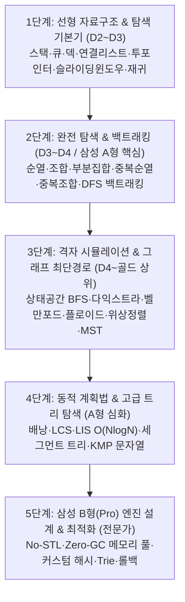

# 🎓 SWEA & CLRS 기반 알고리즘 마스터 정규 커리큘럼

> **본 커리큘럼은 *Introduction to Algorithms (CLRS)*의 컴퓨터과학 이론과 SSAFY 및 삼성 SW 역량테스트(A형·B형 Pro) 실전 코딩테스트 요구사항을 완벽히 통합하여 설계된 체계적 학습 로드맵입니다.**

---

## 📌 1. 커리큘럼 핵심 원칙 및 출제 표준

### 1.1 엄격한 4대 난이도 표준 체계 및 인지적 사고 단계 기반 미세 사다리(Micro-Ladder)
- **난이도 설계 철학**: 단순한 코드 길이, 실행 시간, 문항 수 맞추기가 아닌 **학습자가 문제를 읽고 뇌에서 처리해야 하는 '사고의 단계 수(Cognitive Thinking Steps)'**를 기준으로 난이도를 분할합니다.
- 한 문제에서 2개 이상의 새로운 인지적 도약(예: 기본 원리 + 오프바이원 경계 제어, 재귀 호출 + 다방향 상태 분기 등)을 동시에 강요하지 않으며, 급격한 난이도 도약(Difficulty Spike)을 방지하기 위해 **중간 징검다리(Stepping Stone) 문제를 자율적으로 대폭 증설**합니다.

| 난이도 | 유형 및 명칭 | 세부 미세 사다리 (Micro-Ladder) | 핵심 출제 기준 및 문제 본문 구조 |
| :---: | :--- | :--- | :--- |
| **D2** | **기초 개념 & 5단계 미세 사다리형** | **[Step 1] 직관적 1회 판정**<br/>**[Step 2] 정상 케이스 단일 루프**<br/>**[Step 3] 단일 예외/탈출 처리**<br/>**[Step 4] 표준 개념 뼈대 (`...에 대해서`)**<br/>**[Step 5] 징검다리 경계 완충** | - **Step 1 직관형**: 루프 없이 단 1회의 판정/대입으로 방향성 체득 (예: `UP_DOWN_중앙값_비교`, `단순_부모_배열_조회`)<br/>- **Step 2 단일 루프형**: 이상적인 단일 루프/재귀 트레이스 (예: `탐색_단계수_카운팅`, `배열_2등분_원소_합`)<br/>- **Step 4 개념 뼈대 필수**: `D2_[주제]_[주제]에_대해서` 제목 규격, 원리 설명, 동작 Trace, 표준 구현 |
| **D3** | **실전 응용 & 20인 스토리텔링형** | **[Step 6] 20인 실생활 시나리오 응용** | - **지정 20인 한국 아이 실생활 시나리오** 결합<br/>  * **남아(10명)**: 이준, 도윤, 하준, 시우, 서준, 은우, 유준, 선우, 로운, 도하<br/>  * **여아(10명)**: 이서, 서아, 아윤, 지아, 하윤, 서윤, 시아, 아린, 나은, 유주<br/>- 단일 알고리즘의 실전 상황 적용 및 조건 판별 |
| **D4** | **심화 & 복합 제약조건형** | **[Step 7] 복합 제약 및 시공간 최적화** | - **2~3개 이상의 복합 제약조건** 유기적 결합 (예: 모노톤 스택 $O(N)$, 세그먼트 트리)<br/>- $O(N^2)$ 단순 탐색 시 시간 초과 유발 $\rightarrow$ $O(N)$ 또는 $O(N \log N)$ 최적화 필수 |
| **D5** | **전문가 & 삼성 B형(Pro) 대비형** | **[Step 8] High-Performance 엔지니어링** | - **No-STL / 표준 라이브러리 배제**, 커스텀 자료구조 직접 구현<br/>- **Zero-GC 정적 메모리 풀링**, 롤백(Undo), 비트마스킹 등 고성능 아키텍처 요구 |

### 1.2 주제별 균형 요건 (편향 배제 및 각 난이도 5문제 표준 + 자율 징검다리 증설)
- 각 핵심 주제별로 **D2 $\ge$ 5문제, D3 $\ge$ 5문제, D4 $\ge$ 5문제 (주제당 최소 15문제)**를 철저히 충족하여 특정 주제로의 편향(Bias)을 완벽히 배제합니다.
- 난이도 도약이 심한 주제(이진 탐색, 분할 정복, 서로소 집합 등)는 학습자의 인지 부하 완화를 위해 **D2 문항을 7문제 이상으로 자율 증설(징검다리 완비)**하여 매끄러운 사다리를 구축합니다.
- D2 문제가 5개 이상 존재하더라도, **`D2_[주제]_[주제]에_대해서` 형식의 순수 뼈대 개념 학습 예제 문제는 무조건 1개 이상 필수**로 포함되어야 합니다.
- D3 문제는 **20인 한국 아이 대표 이름** 실생활 스토리텔링을 100% 반영합니다.
- D4 문제는 **복합 제약조건 및 시간/공간 복잡도 최적화**를 요구합니다.

### 1.3 표준 6종 파일 규격 & Java 8 제약조건
- 모든 문제는 아래 6개 파일로 독립 구성:
  1. `문제.txt`: 문제 명세, 개념/Trace/스토리텔링, 제약사항, 입출력 포맷
  2. `sample_input.txt` & `sample_output.txt`: 샘플 테스트케이스 (정확히 2개)
  3. `input.txt` & `output.txt`: 백그라운드 평가용 테스트케이스 (정확히 10개)
  4. `Solution.java`: Java 8 규격, `public class Solution`, Fast I/O 필수 적용
- 시간 제한: 10개 테스트케이스 기준 2.0초 이내 (케이스당 0.2초 이내)
- 메모리 제한: Heap 메모리 256MB 이내

---

## 🗺️ 2. 전체 5단계 커리큘럼 프레임워크 (5-Tier Framework)



---

## 📊 2.5 핵심 22개 커리큘럼 주제 완벽 균형 현황 (각 난이도 >= 5문제 달성)

> **전체 저장소 총 358문제 중 핵심 22개 알고리즘 주제 전수가 D2 $\ge$ 5, D3 $\ge$ 5, D4 $\ge$ 5 (주제당 15~18문제) 및 `D2_[주제]_[주제]에_대해서` 개념 뼈대 예제를 100% 충족하며, 전 문제 디렉토리가 `[주제]/[난이도]_[주제]_[문제제목]`의 체계적인 주제별 계층 구조로 완벽히 정렬되었습니다.**

| 순번 | 핵심 커리큘럼 주제 | D2 (개념 포함) | D3 (20인 스토리) | D4 (복합 최적화) | D5 (B형 Pro) | 총 문제 수 | D2 개념 문제 보유 여부 | 균형 판정 |
| :---: | :--- | :---: | :---: | :---: | :---: | :---: | :---: | :---: |
| 1 | **스택 (Stack)** | 5 | 5 | 5 | 0 | **15** | ✅ `D2_스택_스택에_대해서` | 🎯 완벽 균형 |
| 2 | **큐 (Queue)** | 5 | 5 | 5 | 0 | **15** | ✅ `D2_큐_큐에_대해서` | 🎯 완벽 균형 |
| 3 | **덱 (Deque)** | 5 | 5 | 5 | 0 | **15** | ✅ `D2_덱_덱에_대해서` | 🎯 완벽 균형 |
| 4 | **연결리스트 (Linked List)** | 5 | 5 | 5 | 0 | **15** | ✅ `D2_연결리스트_연결리스트에_대해서` | 🎯 완벽 균형 |
| 5 | **재귀 (Recursion)** | 5 | 5 | 5 | 0 | **15** | ✅ `D2_재귀_재귀에_대해서` | 🎯 완벽 균형 |
| 6 | **투포인터 (Two Pointers)** | 5 | 5 | 5 | 0 | **15** | ✅ `D2_투포인터_투포인터에_대해서` | 🎯 완벽 균형 |
| 7 | **슬라이딩윈도우 (Sliding Window)** | 6 | 5 | 5 | 0 | **16** | ✅ `D2_슬라이딩윈도우_슬라이딩윈도우에_대해서` | 🎯 완벽 균형 (25985 변형 포함) |
| 8 | **순열 (Permutation)** | 5 | 5 | 5 | 0 | **15** | ✅ `D2_순열_순열에_대해서` | 🎯 완벽 균형 |
| 9 | **조합 (Combination)** | 5 | 5 | 5 | 0 | **15** | ✅ `D2_조합_조합에_대해서` | 🎯 완벽 균형 |
| 10 | **부분집합 (Subset)** | 5 | 5 | 5 | 0 | **15** | ✅ `D2_부분집합_부분집합에_대해서` | 🎯 완벽 균형 |
| 11 | **중복순열 (Repetition Permutation)** | 5 | 5 | 5 | 0 | **15** | ✅ `D2_중복순열_중복순열에_대해서` | 🎯 완벽 균형 |
| 12 | **중복조합 (Repetition Combination)** | 5 | 5 | 5 | 0 | **15** | ✅ `D2_중복조합_중복조합에_대해서` | 🎯 완벽 균형 |
| 13 | **이진탐색 (Binary Search)** | 7 | 5 | 5 | 0 | **17** | ✅ `D2_이진탐색_이진탐색에_대해서` | 🎯 완벽 균형 (징검다리 완비) |
| 14 | **그리디 (Greedy)** | 5 | 5 | 5 | 1 | **16** | ✅ `D2_그리디_그리디에_대해서` | 🎯 완벽 균형 |
| 15 | **분할정복 (Divide & Conquer)** | 7 | 5 | 5 | 1 | **18** | ✅ `D2_분할정복_분할정복에_대해서` | 🎯 완벽 균형 (징검다리 완비) |
| 16 | **BFS (너비 우선 탐색)** | 5 | 5 | 5 | 1 | **16** | ✅ `D2_BFS_BFS에_대해서` | 🎯 완벽 균형 |
| 17 | **DFS (깊이 우선 탐색)** | 5 | 5 | 5 | 2 | **17** | ✅ `D2_DFS_DFS에_대해서` | 🎯 완벽 균형 |
| 18 | **서로소집합 (Union-Find)** | 7 | 5 | 5 | 1 | **18** | ✅ `D2_서로소집합_서로소집합에_대해서` | 🎯 완벽 균형 (징검다리 완비) |
| 19 | **최소 신장 트리 (MST)** | 5 | 5 | 5 | 0 | **15** | ✅ `D2_MST_MST에_대해서` | 🎯 완벽 균형 |
| 20 | **위상정렬 (Topological Sort)** | 5 | 5 | 5 | 0 | **15** | ✅ `D2_위상정렬_위상정렬에_대해서` | 🎯 완벽 균형 |
| 21 | **최단경로 (Dijkstra / Floyd)** | 5 | 5 | 5 | 1 | **16** | ✅ `D2_최단경로_최단경로에_대해서` | 🎯 완벽 균형 |
| 22 | **동적 계획법 (DP)** | 5 | 5 | 5 | 1 | **16** | ✅ `D2_DP_DP에_대해서` | 🎯 완벽 균형 |

---

## 📚 3. 단계별 상세 학습 로드맵 및 핵심 주제 구성

### 🔷 [1단계] 선형 자료구조 & 선형 탐색 기본기 (권장 1~2주차)
> **목표**: 자료구조의 입출력 특성(LIFO, FIFO, 양방향)을 완벽히 체화하고, $O(N)$ 선형 시간 최적화 감각을 익힌다.

| 주제 | D2 (개념 예제 필수) | D3 (20인 스토리텔링) | D4 (복합 제약 심화) |
| :--- | :--- | :--- | :--- |
| **스택 (Stack)** | `D2_스택_스택에_대해서`<br/>`D2_스택_올바른_괄호쌍`<br/>`D2_스택_숫자_되돌리기_제로` | `D3_스택_후위표기식_계산기`<br/>`D3_스택_서준이의_쇠막대기_자르기`<br/>`D3_스택_시우의_균형잡힌_문자열` | `D4_스택_탑_레이저_신호_수신`<br/>`D4_스택_오큰수_수열_탐색`<br/>`D4_스택_히스토그램_가장큰직사각형` |
| **큐 (Queue)** | `D2_큐_큐에_대해서`<br/>`D2_큐_카드_버리기와_옮기기`<br/>`D2_큐_원형_순번_추출_요세푸스` | `D3_큐_암호생성기_회전`<br/>`D3_큐_도윤이의_프린터_대기열`<br/>`D3_큐_지아의_은행_창구_시뮬레이션` | `D4_큐_트럭의_다리_건너기`<br/>`D4_큐_멀티태스킹_CPU_라운드로빈`<br/>`D4_큐_슬라이딩윈도우_덱_최솟값` |
| **덱 & 투포인터** | `D2_슬라이딩윈도우_연속_온도_최대합` | `D3_덱_풍선_터뜨리기`<br/>`D3_투포인터_연속구간_부분합` | `D4_투포인터_두_용액_혼합_최적화` |
| **이진탐색 & 분할정복** | **[이진탐색 징검다리]**<br/>`D2_이진탐색_UP_DOWN_중앙값_비교`<br/>`D2_이진탐색_탐색_단계수_카운팅`<br/>`D2_이진탐색_이진탐색에_대해서`<br/>`D2_이진탐색_Lower_Bound_찾기`<br/>**[분할정복 징검다리]**<br/>`D2_분할정복_1차원_배열_반으로_자르기`<br/>`D2_분할정복_배열_2등분_원소_합`<br/>`D2_분할정복_분할정복에_대해서` | `D3_이진탐색_도윤이의_도서_대출`<br/>`D3_이진탐색_서아의_과자_분배`<br/>`D3_분할정복_선우의_행렬_거듭제곱`<br/>`D3_분할정복_아윤이의_쿼드트리_압축` | `D4_이진탐색_공유기_거리_극대화`<br/>`D4_이진탐색_K번째_수_구구단_배열`<br/>`D4_분할정복_최대_부분배열_합_카디널`<br/>`D4_분할정복_배열_역순쌍_머지소트` |
| **연결리스트 & 재귀** | `D2_재귀_재귀에_대해서`<br/>`D2_재귀_피보나치_호출_원리`<br/>`D2_연결리스트_연결리스트에_대해서` | `D3_재귀_하노이의_탑_이동_순서`<br/>`D3_연결리스트_서아의_단어_사슬_잇기`<br/>`D3_연결리스트_도윤이의_암호문_복원` | `D4_연결리스트_커서_기반_텍스트_에디터`<br/>`D4_연결리스트_LRU_캐시_DLL_해시_결합` |

---

### 🔷 [2단계] 완전 탐색 & 백트래킹 A형 마스터 (권장 3~5주차)
> **목표**: 모든 상태 공간을 누락 없이 순회하는 5대 완탐 기법(순열·조합·부분집합·중복순열·중복조합)을 마스터하고, 유망하지 않은 분기를 가지치는 백트래킹을 완벽히 습득한다.

| 주제 | D2 (개념 예제 필수) | D3 (20인 스토리텔링) | D4 (복합 제약 심화) |
| :--- | :--- | :--- | :--- |
| **순열 (Permutation)** | `D2_순열_순열에_대해서`<br/>`D2_순열_놀이공원_줄세우기`<br/>`D2_순열_알파벳_단어_만들기` | `D3_순열_사전순_다음_순열`<br/>`D3_순열_원형_테이블_좌석_배치`<br/>`D3_순열_규영이와_인영이_카드게임` | `D4_순열_과일트럭_최단배달`<br/>`D4_순열_부등호_수열_생성`<br/>`D4_순열_작업_공정_최적순서` |
| **조합 (Combination)** | `D2_조합_조합에_대해서`<br/>`D2_조합_도서관_책_선택`<br/>`D2_조합_생과일주스_레시피` | `D3_조합_두_팀으로_나누기`<br/>`D3_조합_디저트_선물세트_궁합`<br/>`D3_조합_로또_행운의_조합` | `D4_조합_감시카메라_배치`<br/>`D4_조합_과수원_스프링클러_설치`<br/>`D4_조합_치킨거리_최소화` |
| **부분집합 (Subset)** | `D2_부분집합_부분집합에_대해서`<br/>`D2_부분집합_배낭_무게_한도`<br/>`D2_부분집합_부분수열의_합` | `D3_부분집합_스도쿠_후보숫자_마스킹`<br/>`D3_부분집합_원소의_합_균등분할`<br/>`D3_부분집합_식료품_칼로리_조합` | `D4_부분집합_격자_도미노_비트마스크`<br/>`D4_부분집합_비트마스크_시너지_극대화`<br/>`D4_부분집합_비트마스크_외판원_DP` |
| **중복순열 & 중복조합** | `D2_중복순열_가위바위보_대진표`<br/>`D2_중복조합_무기명_투표_개표` | `D3_중복순열_주사위_눈금_합`<br/>`D3_중복조합_과일빙수_스쿱` | `D4_중복순열_로봇_이동_명령어_조합`<br/>`D4_중복조합_포션_제조_배합비` |
| **DFS 백트래킹** | `D2_DFS_DFS에_대해서`<br/>`D2_DFS_방문_순서_출력` | `D3_DFS_섬_개수_카운팅`<br/>`D3_DFS_바이러스_감염_확산` | `D4_DFS_연구소_벽세우기`<br/>`D4_DFS_알파벳_경로_최대방문`<br/>`D5_DFS_N_Queen_배치` |

---

### 🔷 [3단계] 격자 시뮬레이션 & 그래프 최단 경로 (권장 6~7주차)
> **목표**: 4방 델타 탐색 기반 시뮬레이션과 가중치 그래프 최단 거리 알고리즘을 실전 코딩테스트 수준으로 구현한다.

| 주제 | D2 (개념 예제 필수) | D3 (20인 스토리텔링) | D4 (복합 제약 심화) |
| :--- | :--- | :--- | :--- |
| **BFS 상태공간 탐색** | `D2_BFS_BFS에_대해서`<br/>`D2_BFS_미로_도착_가능여부` | `D3_BFS_미로_최단거리`<br/>`D3_BFS_토마토_숙성_창고` | `D4_BFS_불과_탈출`<br/>`D4_BFS_벽_부수고_이동하기`<br/>`D4_BFS_연구소_보안탈출` |
| **최단 경로 (Dijkstra)** | `D2_최단경로_다익스트라_기초`<br/>`D2_최단경로_플로이드워셜_기초` | `D3_최단경로_나은이의_지하철_환승_여행`<br/>`D3_최단경로_하윤이의_키_순서_비교` | `D4_최단경로_특정_경유지_왕복_다익스트라`<br/>`D4_최단경로_벨만포드_타임머신_탐색`<br/>`D5_최단경로_K번째_최단경로_탐색` |
| **서로소 집합 & MST** | **[서로소집합 징검다리]**<br/>`D2_서로소집합_단순_부모_배열_조회`<br/>`D2_서로소집합_루트_노드_직접_추적`<br/>`D2_서로소집합_서로소집합에_대해서`<br/>`D2_서로소집합_유니온파인드_기초`<br/>**[MST 기초]**<br/>`D2_MST_MST에_대해서`<br/>`D2_MST_크루스칼_알고리즘_기초` | `D3_서로소집합_서준이의_친구_네트워크`<br/>`D3_서로소집합_나은이의_집합_연산`<br/>`D3_MST_서윤이의_스마트시티_전력망` | `D4_MST_두번째_최소신장트리`<br/>`D4_서로소집합_물류창고_폐쇄와_연결성`<br/>`D5_서로소집합_대규모_네트워크_복구_설계` |
| **위상 정렬 (Topology)** | `D2_위상정렬_작업_순서_결정` | `D3_위상정렬_도하의_선수과목_체계` | `D4_위상정렬_임계경로_작업_스케줄러` |

---

### 🔷 [4단계] 동적 계획법 & 고급 탐색 (권장 8~9주차)
> **목표**: 점화식 도출 능력, $O(N \log N)$ 최적화 및 대용량 질의(세그먼트 트리) 처리 기술을 습득한다.

| 주제 | D2 (개념 예제 필수) | D3 (20인 스토리텔링) | D4 (복합 제약 심화) |
| :--- | :--- | :--- | :--- |
| **기본 DP (메모이제이션)** | `D2_DP_피보나치_수열_메모이제이션`<br/>`D2_DP_정수_삼각형_최대경로`<br/>`D2_DP_막대_자르기` | `D3_DP_선우의_연속합_최대구간`<br/>`D3_DP_아윤이의_계단_오르기`<br/>`D3_DP_유준이의_01_배낭_싸기` | `D4_DP_동전_교환_경우의_수`<br/>`D4_DP_최장_공통_부분수열_LCS`<br/>`D4_DP_행렬_곱셈_순서_최적화` |
| **LIS & 고급 DP** | `D2_DP_증가수열_기초` | `D3_DP_숫자_카드_배열` | `D4_DP_최장_증가_부분수열_LIS`<br/>`D5_DP_외판원_순회_비트마스크` |
| **세그먼트 트리 & 문자열** | `D2_문자열_팰린드롬_판별` | `D3_문자열_KMP_부분문자열_탐색` | `D4_세그먼트트리_구간합_갱신_질의`<br/>`D4_그래프_강결합_컴포넌트_타잔` |

---

### 🔷 [5단계] 삼성 코딩테스트 B형(Pro) 엔진 개발 (권장 10~12주차)
> **목표**: Java Garbage Collection 정지(Zero-GC) 기법, No-STL 정적 메모리 풀링 및 커스텀 해시/트리 실전 모듈 설계.

- **핵심 기술 스택**:
  1. **정적 배열 풀링 (Static Node Pooling)**: `new` 키워드를 테스트케이스 루프 내에서 완전히 배제
  2. **커스텀 해시 테이블 (Custom Hash Table)**: Chaining 방식 및 문자열 해시 함수(djb2 등) 직접 구현
  3. **롤백 유니온파인드 (Rollback Disjoint Set)**: 연산 취소(Undo) 스택 기반 상태 복구 엔진
  4. **비트마스크 압축 & 메모리 캐싱**: 64비트 정수 bitwise 연산으로 대규모 상태 인덱싱
- **대표 수록 문제**:
  - `D5_서로소집합_대규모_네트워크_복구_설계` (No-STL 롤백 유니온파인드)
  - `D5_최단경로_K번째_최단경로_탐색` (커스텀 힙 기반 고속 다익스트라)
  - `D5_DP_외판원_순회_비트마스크` (20개 정점 TSP 비트마스크 메모이제이션)
  - `D5_그리디_허프만_인코딩_트리_구축` (정적 트리 노드 풀링 기반 압축 엔진)

---

## 💻 4. 실전 Java 표준 핵심 템플릿

### 4.1 고속 입출력 및 SWEA 제출 표준 템플릿
```java
import java.io.*;
import java.util.*;

public class Solution {
    public static void main(String[] args) throws Exception {
        BufferedReader br = new BufferedReader(new InputStreamReader(System.in));
        String line = br.readLine();
        if (line == null) return;
        int T = Integer.parseInt(line.trim());
        StringBuilder sb = new StringBuilder();

        for (int tc = 1; tc <= T; tc++) {
            StringTokenizer st = new StringTokenizer(br.readLine());
            int n = Integer.parseInt(st.nextToken());
            
            // 알고리즘 로직 수행
            int result = 0;

            sb.append("#").append(tc).append(" ").append(result).append("\n");
        }
        System.out.print(sb);
    }
}
```

### 4.2 D2 개념 템플릿: 스택 배열 직접 구현
```java
class ArrayStack {
    int[] data;
    int top = 0;

    ArrayStack(int capacity) {
        data = new int[capacity];
    }
    void push(int val) { data[top++] = val; }
    int pop() { return top == 0 ? -1 : data[--top]; }
    int peek() { return top == 0 ? -1 : data[top - 1]; }
    int size() { return top; }
    int empty() { return top == 0 ? 1 : 0; }
}
```

### 4.3 D4 모노톤 스택 템플릿 ($O(N)$ 오큰수 / 히스토그램)
```java
int[] stack = new int[n];
int top = 0;
for (int i = 0; i < n; i++) {
    while (top > 0 && arr[stack[top - 1]] < arr[i]) {
        int idx = stack[--top];
        nge[idx] = arr[i]; // 오른쪽에 있는 가장 가까운 큰 수 확정
    }
    stack[top++] = i;
}
```

---

## 🛠️ 5. 에이전트 시스템 및 QA 활용 가이드

저장소에는 문제를 관리하고 품질을 유지하기 위한 두 개의 핵심 도구가 탑재되어 있습니다:

### 1) 실시간 품질 감사 에이전트 ([`qa_agent.py`](file:///c:/Users/SSAFY/Desktop/SWEAProblemSet/qa_agent.py))
- `python qa_agent.py audit` : 31개 전체 주제에 대해 D2/D3/D4 각 5문제 충족 여부 및 `[주제]에 대해서` 개념 예제 보유 여부를 전수 감사
- `python qa_agent.py ladder [주제]` : 각 주제별 4~5단계 계단식(Ladder) 난이도 편차 및 징검다리 구성 상태 정밀 진단
- `python qa_agent.py verify --all` : 전체 문제의 6종 파일 규격, Java 8 컴파일, 12개 테스트케이스 채점 및 통과 여부 검증
- `python qa_agent.py inspect [폴더명]` : `문제.txt` 본문의 개념 설명, 20인 아이 이름 스토리텔링, 복합 제약조건 수록 여부 정밀 검사

### 2) 총괄 문제 관리 에이전트 ([`agent.py`](file:///c:/Users/SSAFY/Desktop/SWEAProblemSet/agent.py))
- `python agent.py list` : 전체 문제 목록 및 파일 상태 조회
- `python agent.py spec` : 최신 사용자 요구사항 명세서 출력 (D2 계단식 난이도 조절 및 자율 증설 표준 반영)
