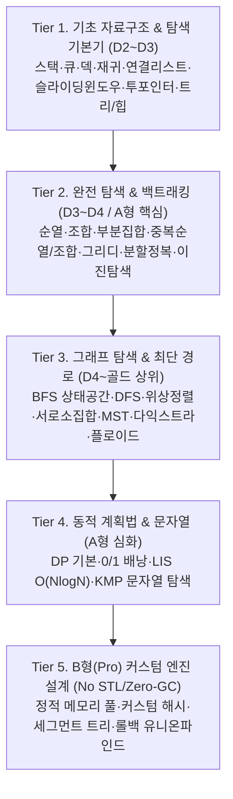

# 📚 삼성 SWEA & 백준 연계 알고리즘 마스터 문제집 (총 358문제)

> **본 저장소는 삼성 SW 역량테스트(A형·B형 Pro) 및 코딩테스트 합격을 위해, *Introduction to Algorithms (CLRS)* 및 SWEA·백준 핵심 빈출 유형을 5단계 계층형 커리큘럼으로 완전 재구성한 Java 전용 실전 문제집입니다.**
> **모든 문제는 `[주제]/[난이도]_[주제]_[문제제목]`의 31개 주제별 계층 디렉토리 구조로 체계적으로 분류되어 관리됩니다.**

---

## 📌 주요 특징 및 규격

1. **Java 전용 제약조건 준수**:
   - 모든 문제는 **Java (Java 8 이상)** 기준
   - 클래스명 `public class Solution` (SWEA 표준 규격)
   - 10개 테스트케이스 기준 2.0초 이내, 힙 메모리 256MB 이내
   - 고속 입출력(`BufferedReader`, `StringTokenizer`, `StringBuilder`) 최적화 적용

2. **표준 6종 파일 규격 완비 (전체 358문제 100% 완비)**:
   - `문제.txt`: 문제 명세서, 인지적 사고 단계 기반 개념/원리/Trace(D2), 20인 실생활 시나리오(D3), 복합 제약조건(D4/D5), 입출력 포맷
   - `sample_input.txt` & `sample_output.txt`: 샘플 테스트케이스 (정확히 2개)
   - `input.txt` & `output.txt`: 백그라운드 평가용 테스트케이스 (정확히 10개)
   - `Solution.java`: 컴파일 및 12개 테스트케이스 100% 통과(PASS) 검증 완료된 Java 솔루션

3. **주제별 계층 디렉토리 및 인지적 사고 단계 기반 미세 사다리**:
   - **주제별 계층화**: 31개 알고리즘 주제 폴더 하위에 문제 디렉토리가 위치하여 직관적인 파일 탐색 지원 (`슬라이딩윈도우/D2_슬라이딩윈도우_.../`)
   - **학습자 사고 단계 기준 분할**: 단순히 코드 라인 수가 아닌 학습자가 머릿속으로 처리하는 인지 단계 수를 기준으로 난이도를 분할하며, 급격한 난이도 도약(Difficulty Spike)을 방지하기 위해 **중간 징검다리 문제를 자율적으로 대폭 증설(주제당 15~18문제)**.
   - **D2 (기초 개념 & 5단계 미세 사다리 - 120문제)**: 
     - [Step 1 직관/1회판정] -> [Step 2 단일루프/추적] -> [Step 3 단일예외] -> [Step 4 개념뼈대(`...에 대해서`)] -> [Step 5 경계완충/징검]
     - 특히 이진탐색, 분할정복, 서로소집합, 슬라이딩윈도우(SWEA 25985 변형 신규 문제 포함) 등 주요 주제의 난이도 편차를 완전히 해소.
   - **D3 (응용 및 실생활 스토리텔링 - 114문제)**: 사용자 지정 한국 아이 대표 이름 20인(남자: 이준, 도윤, 하준, 시우, 서준, 은우, 유준, 선우, 로운, 도하 / 여자: 이서, 서아, 아윤, 지아, 하윤, 서윤, 시아, 아린, 나은, 유주)을 활용한 생생한 실생활 스토리텔링 응용 문제.
   - **D4 (심화 및 복합 제약 - 116문제)**: 2~3개 이상의 까다로운 복합 제약조건과 최적화(O(N) 모노톤, 비트마스크, 매개변수 탐색 등)가 유기적으로 결합된 고난도 문제.
   - **D5 (삼성 SW 역량테스트 Professional / B형 - 8문제)**: 대규모 데이터, 비트마스킹 DP, 롤백(Undo) 유니온파인드, K번째 최단경로, No-STL 커스텀 자료구조 등 고도의 최적화 알고리즘 문제.

4. **품질 보증 에이전트(qa_agent.py) 및 실시간 업로드 관리**:
   - `python qa_agent.py audit` : 31개 주제별 난이도 편향 및 결핍 실시간 전수 감사 (22개 핵심 주제 완벽 균형 달성)
   - `python qa_agent.py ladder [주제]` : 주제별 5단계 미세 사다리 및 난이도 계단식 편차 정밀 진단
   - `python qa_agent.py verify [경로/문제명]` : 개별 또는 전체 문제 12개 테스트케이스 100% PASS 검증
   - `python qa_agent.py upload` (또는 `python agent.py upload`) : 358문항 실시간 업로드 현황 조회 (달성률, 완료/진행/대기)
   - `python qa_agent.py upload --mark [문제] [완료/진행/대기] [--id SWEA번호]` : 문항 업로드 상태 즉시 마킹 및 엑셀 실시간 동기화

5. **통합 엑셀 대시보드 및 연간 일정 연동 (2개 통합 문서)**:
   - **[`SWEA_알고리즘_문제집_커리큘럼.xlsx`](file:///c:/Users/SSAFY/Desktop/SWEAProblemSet/SWEA_알고리즘_문제집_커리큘럼.xlsx)** (총 6개 시트):
     - `📊 대시보드_요약` : 358문항 KPI 카드, 31개 주제별 난이도 매트릭스, **실시간 업로드 진척도 집계 카드**
     - `📅 SSAFY_강의연계_업로드_로드맵` : 김태희 강사 공식 강의 86클립(W06~W09)과 358제 생성 문제 1:1 매칭 및 업로드 관리
     - `📋 전체_문제_목록` : 358문항 전수 DB 및 **인셀 드롭다운(DataValidation: ✅ 업로드 완료 / ⏳ 검토중 / ⬜ 대기) & 조건부 서식**
     - `🪜 D2_사다리_징검다리`, `👶 D3_20인_스토리텔링`, `🏆 D4_D5_심화_Pro` : 시트별 맞춤 정렬 및 업로드 상태 추적
   - **[`year/yearlySchedule.v2.10.xlsx`](file:///c:/Users/SSAFY/Desktop/SWEAProblemSet/year/yearlySchedule.v2.10.xlsx)** :
     - `06_SWEA_생성문제_358_업로드_DB` 시트 신설로 SSAFY 연간 일정 및 강의 로드맵과의 완벽한 1:1 연동 지원

---

## 🗺️ 5단계 커리큘럼 프레임워크 (5-Tier Architecture)



---

## 📂 5단계 커리큘럼별 문제집 수록 목록 (총 147문제 전수 매핑)

### 🔹 Tier 1. 기초 자료구조 & 탐색 기본기 (D2 ~ D3 수준) [25문제]

#### 1. 스택 (Stack)
> **추천 연계**: SWEA 1218(괄호 짝짓기), SWEA 1222(계산기1), 백준 10828(스택), 백준 9012(괄호), 백준 2493(탑)
- [`D2_스택_스택에_대해서`](file:///c:/Users/SSAFY/Desktop/SWEAProblemSet/D2_스택_스택에_대해서) *(D2 대표 개념 예제: LIFO 원리, push/pop/top/size Trace & 구현)*
- [`D2_스택_올바른_괄호쌍`](file:///c:/Users/SSAFY/Desktop/SWEAProblemSet/D2_스택_올바른_괄호쌍)
- [`D2_스택_숫자_되돌리기_제로`](file:///c:/Users/SSAFY/Desktop/SWEAProblemSet/D2_스택_숫자_되돌리기_제로)
- [`D3_스택_후위표기식_계산기`](file:///c:/Users/SSAFY/Desktop/SWEAProblemSet/D3_스택_후위표기식_계산기)
- [`D3_스택_서준이의_쇠막대기_자르기`](file:///c:/Users/SSAFY/Desktop/SWEAProblemSet/D3_스택_서준이의_쇠막대기_자르기)
- [`D3_스택_시우의_균형잡힌_문자열`](file:///c:/Users/SSAFY/Desktop/SWEAProblemSet/D3_스택_시우의_균형잡힌_문자열)
- [`D4_스택_탑_레이저_신호_수신`](file:///c:/Users/SSAFY/Desktop/SWEAProblemSet/D4_스택_탑_레이저_신호_수신) *(모노톤 스택)*
- [`D4_스택_오큰수_수열_탐색`](file:///c:/Users/SSAFY/Desktop/SWEAProblemSet/D4_스택_오큰수_수열_탐색) *(모노톤 스택)*
- [`D4_스택_히스토그램_가장큰직사각형`](file:///c:/Users/SSAFY/Desktop/SWEAProblemSet/D4_스택_히스토그램_가장큰직사각형) *(모노톤 스택)*

#### 2. 큐 & 덱 (Queue & Deque)
> **추천 연계**: SWEA 1225(암호생성기), 백준 10845(큐), 백준 2164(카드2), 백준 10866(덱)
- [`D2_큐_큐에_대해서`](file:///c:/Users/SSAFY/Desktop/SWEAProblemSet/D2_큐_큐에_대해서) *(D2 대표 개념 예제: FIFO 원리, offer/poll/front/back Trace & 구현)*
- [`D2_큐_카드_버리기와_옮기기`](file:///c:/Users/SSAFY/Desktop/SWEAProblemSet/D2_큐_카드_버리기와_옮기기)
- [`D2_큐_원형_순번_추출_요세푸스`](file:///c:/Users/SSAFY/Desktop/SWEAProblemSet/D2_큐_원형_순번_추출_요세푸스)
- [`D3_큐_암호생성기_회전`](file:///c:/Users/SSAFY/Desktop/SWEAProblemSet/D3_큐_암호생성기_회전)
- [`D3_큐_도윤이의_프린터_대기열`](file:///c:/Users/SSAFY/Desktop/SWEAProblemSet/D3_큐_도윤이의_프린터_대기열)
- [`D3_큐_지아의_은행_창구_시뮬레이션`](file:///c:/Users/SSAFY/Desktop/SWEAProblemSet/D3_큐_지아의_은행_창구_시뮬레이션)
- [`D4_큐_우선순위큐_중앙값_실시간_추적`](file:///c:/Users/SSAFY/Desktop/SWEAProblemSet/D4_큐_우선순위큐_중앙값_실시간_추적)
- [`D4_큐_멀티태스킹_CPU_라운드로빈`](file:///c:/Users/SSAFY/Desktop/SWEAProblemSet/D4_큐_멀티태스킹_CPU_라운드로빈)
- [`D4_큐_슬라이딩윈도우_덱_최솟값`](file:///c:/Users/SSAFY/Desktop/SWEAProblemSet/D4_큐_슬라이딩윈도우_덱_최솟값) *(모노톤 덱)*
- [`D3_덱_풍선_터뜨리기`](file:///c:/Users/SSAFY/Desktop/SWEAProblemSet/D3_덱_풍선_터뜨리기)

#### 3. 재귀 호출 (Recursion) & 연결 리스트 (Linked List)
> **추천 연계**: SWEA 1217(거듭 제곱), 백준 11729(하노이 탑), SWEA 1228(암호문1), 백준 1406(에디터)
- [`D3_재귀_하노이의_탑_이동_순서`](file:///c:/Users/SSAFY/Desktop/SWEAProblemSet/D3_재귀_하노이의_탑_이동_순서)
- [`D3_연결리스트_암호문_복원`](file:///c:/Users/SSAFY/Desktop/SWEAProblemSet/D3_연결리스트_암호문_복원)

#### 4. 슬라이딩 윈도우 & 투 포인터
> **추천 연계**: 백준 2559(수열), 백준 2003(수들의 합 2), 백준 1806(부분합)
- [`D2_슬라이딩윈도우_연속_온도_최대합`](file:///c:/Users/SSAFY/Desktop/SWEAProblemSet/D2_슬라이딩윈도우_연속_온도_최대합)
- [`D3_투포인터_연속구간_부분합`](file:///c:/Users/SSAFY/Desktop/SWEAProblemSet/D3_투포인터_연속구간_부분합)

#### 5. 트리 & 힙 기초 (Tree & Heap)
> **추천 연계**: SWEA 1231(중위순회), 백준 1991(트리 순회), SWEA 2930(힙), 백준 1927(최소 힙)
- [`D3_정렬_힙_정렬과_우선순위큐`](file:///c:/Users/SSAFY/Desktop/SWEAProblemSet/D3_정렬_힙_정렬과_우선순위큐)
- [`D4_자료구조_이진탐색트리_범위합`](file:///c:/Users/SSAFY/Desktop/SWEAProblemSet/D4_자료구조_이진탐색트리_범위합)

---

### 🔹 Tier 2. 완전 탐색 & 백트래킹 (D3 ~ D4 / A형 핵심) [65문제]

#### 1. 순열 (Permutation)
> **추천 연계**: 백준 15649(N과 M 1), 백준 10974(모든 순열), 백준 10972(다음 순열), SWEA 6808(규영이와 인영이)
- [`D2_순열_과일_파르페_쌓기`](file:///c:/Users/SSAFY/Desktop/SWEAProblemSet/D2_순열_과일_파르페_쌓기)
- [`D2_순열_놀이공원_줄세우기`](file:///c:/Users/SSAFY/Desktop/SWEAProblemSet/D2_순열_놀이공원_줄세우기)
- [`D2_순열_알파벳_단어_만들기`](file:///c:/Users/SSAFY/Desktop/SWEAProblemSet/D2_순열_알파벳_단어_만들기)
- [`D3_순열_사전순_다음_순열`](file:///c:/Users/SSAFY/Desktop/SWEAProblemSet/D3_순열_사전순_다음_순열)
- [`D3_순열_원형_테이블_좌석_배치`](file:///c:/Users/SSAFY/Desktop/SWEAProblemSet/D3_순열_원형_테이블_좌석_배치)
- [`D4_순열_과일트럭_최단배달`](file:///c:/Users/SSAFY/Desktop/SWEAProblemSet/D4_순열_과일트럭_최단배달)
- [`D4_순열_N자리_순열_사전순_K번째_복원`](file:///c:/Users/SSAFY/Desktop/SWEAProblemSet/D4_순열_N자리_순열_사전순_K번째_복원)
- [`D4_순열_작업_공정_최적순서`](file:///c:/Users/SSAFY/Desktop/SWEAProblemSet/D4_순열_작업_공정_최적순서)

#### 2. 조합 (Combination)
> **추천 연계**: 백준 15650(N과 M 2), 백준 6603(로또), 백준 1759(암호 만들기)
- [`D2_조합_도서관_책_선택`](file:///c:/Users/SSAFY/Desktop/SWEAProblemSet/D2_조합_도서관_책_선택)
- [`D2_조합_생과일주스_레시피`](file:///c:/Users/SSAFY/Desktop/SWEAProblemSet/D2_조합_생과일주스_레시피)
- [`D2_조합_팀_대표_선발`](file:///c:/Users/SSAFY/Desktop/SWEAProblemSet/D2_조합_팀_대표_선발)
- [`D3_조합_두_팀으로_나누기`](file:///c:/Users/SSAFY/Desktop/SWEAProblemSet/D3_조합_두_팀으로_나누기)
- [`D3_조합_디저트_선물세트_궁합`](file:///c:/Users/SSAFY/Desktop/SWEAProblemSet/D3_조합_디저트_선물세트_궁합)
- [`D3_조합_로또_행운의_조합`](file:///c:/Users/SSAFY/Desktop/SWEAProblemSet/D3_조합_로또_행운의_조합)
- [`D4_조합_감시카메라_배치`](file:///c:/Users/SSAFY/Desktop/SWEAProblemSet/D4_조합_감시카메라_배치)
- [`D4_조합_과수원_스프링클러_설치`](file:///c:/Users/SSAFY/Desktop/SWEAProblemSet/D4_조합_과수원_스프링클러_설치)
- [`D4_조합_도심_스프링클러_최적_감시_배치`](file:///c:/Users/SSAFY/Desktop/SWEAProblemSet/D4_조합_도심_스프링클러_최적_감시_배치)

#### 3. 부분집합 & 비트마스킹 (Subset & Bitmask)
> **추천 연계**: SWEA 2817(부분 수열의 합), 백준 1182(부분수열의 합), 백준 10971(외판원 순회 2)
- [`D2_부분집합_배낭_무게_한도`](file:///c:/Users/SSAFY/Desktop/SWEAProblemSet/D2_부분집합_배낭_무게_한도)
- [`D2_부분집합_부분수열의_합`](file:///c:/Users/SSAFY/Desktop/SWEAProblemSet/D2_부분집합_부분수열의_합)
- [`D2_부분집합_요거트볼_토핑`](file:///c:/Users/SSAFY/Desktop/SWEAProblemSet/D2_부분집합_요거트볼_토핑)
- [`D3_부분집합_스도쿠_후보숫자_마스킹`](file:///c:/Users/SSAFY/Desktop/SWEAProblemSet/D3_부분집합_스도쿠_후보숫자_마스킹)
- [`D3_부분집합_원소의_합_균등분할`](file:///c:/Users/SSAFY/Desktop/SWEAProblemSet/D3_부분집합_원소의_합_균등분할)
- [`D4_부분집합_격자_도미노_비트마스크`](file:///c:/Users/SSAFY/Desktop/SWEAProblemSet/D4_부분집합_격자_도미노_비트마스크)
- [`D4_부분집합_비트마스크_시너지_극대화`](file:///c:/Users/SSAFY/Desktop/SWEAProblemSet/D4_부분집합_비트마스크_시너지_극대화)
- [`D4_부분집합_비트마스크_외판원_DP`](file:///c:/Users/SSAFY/Desktop/SWEAProblemSet/D4_부분집합_비트마스크_외판원_DP)

#### 4. 중복순열 & 중복조합
- [`D2_중복순열_가위바위보_대진표`](file:///c:/Users/SSAFY/Desktop/SWEAProblemSet/D2_중복순열_가위바위보_대진표)
- [`D2_중복순열_디지털_도어락_비밀번호`](file:///c:/Users/SSAFY/Desktop/SWEAProblemSet/D2_중복순열_디지털_도어락_비밀번호)
- [`D3_중복순열_과일_탕후루_제작`](file:///c:/Users/SSAFY/Desktop/SWEAProblemSet/D3_중복순열_과일_탕후루_제작)
- [`D3_중복순열_신호등_점등_패턴`](file:///c:/Users/SSAFY/Desktop/SWEAProblemSet/D3_중복순열_신호등_점등_패턴)
- [`D3_중복순열_주사위_눈금_합`](file:///c:/Users/SSAFY/Desktop/SWEAProblemSet/D3_중복순열_주사위_눈금_합)
- [`D4_중복순열_로봇_이동_명령어_조합`](file:///c:/Users/SSAFY/Desktop/SWEAProblemSet/D4_중복순열_로봇_이동_명령어_조합)
- [`D4_중복순열_모스부호_문자열_복원`](file:///c:/Users/SSAFY/Desktop/SWEAProblemSet/D4_중복순열_모스부호_문자열_복원)
- [`D2_중복조합_무기명_투표_개표`](file:///c:/Users/SSAFY/Desktop/SWEAProblemSet/D2_중복조합_무기명_투표_개표)
- [`D2_중복조합_사탕_바구니_나누기`](file:///c:/Users/SSAFY/Desktop/SWEAProblemSet/D2_중복조합_사탕_바구니_나누기)
- [`D3_중복조합_과일빙수_스쿱`](file:///c:/Users/SSAFY/Desktop/SWEAProblemSet/D3_중복조합_과일빙수_스쿱)
- [`D3_중복조합_방정식_정수해_개수`](file:///c:/Users/SSAFY/Desktop/SWEAProblemSet/D3_중복조합_방정식_정수해_개수)
- [`D3_중복조합_비내림차순_수열_생성`](file:///c:/Users/SSAFY/Desktop/SWEAProblemSet/D3_중복조합_비내림차순_수열_생성)
- [`D4_중복조합_다항식_항_생성`](file:///c:/Users/SSAFY/Desktop/SWEAProblemSet/D4_중복조합_다항식_항_생성)
- [`D4_중복조합_포션_제조_배합비`](file:///c:/Users/SSAFY/Desktop/SWEAProblemSet/D4_중복조합_포션_제조_배합비)

#### 5. 탐욕 알고리즘 (Greedy)
> **추천 연계**: 백준 11047(동전 0), 백준 1931(회의실 배정), 백준 1202(보석 도둑)
- [`D2_그리디_단순_활동_선택`](file:///c:/Users/SSAFY/Desktop/SWEAProblemSet/D2_그리디_단순_활동_선택)
- [`D2_그리디_동전_교환_최소화`](file:///c:/Users/SSAFY/Desktop/SWEAProblemSet/D2_그리디_동전_교환_최소화)
- [`D2_그리디_체육복_대여_도우미`](file:///c:/Users/SSAFY/Desktop/SWEAProblemSet/D2_그리디_체육복_대여_도우미)
- [`D3_그리디_시우의_스터디룸_배정`](file:///c:/Users/SSAFY/Desktop/SWEAProblemSet/D3_그리디_시우의_스터디룸_배정)
- [`D3_그리디_은우의_물류_트럭_적재`](file:///c:/Users/SSAFY/Desktop/SWEAProblemSet/D3_그리디_은우의_물류_트럭_적재)
- [`D3_그리디_지아의_신입사원_선발`](file:///c:/Users/SSAFY/Desktop/SWEAProblemSet/D3_그리디_지아의_신입사원_선발)
- [`D4_그리디_센서_통신_기지국_설치`](file:///c:/Users/SSAFY/Desktop/SWEAProblemSet/D4_그리디_센서_통신_기지국_설치)
- [`D4_그리디_작업_마감기한_스케줄링`](file:///c:/Users/SSAFY/Desktop/SWEAProblemSet/D4_그리디_작업_마감기한_스케줄링)
- [`D4_그리디_주유소_최소비용_이동`](file:///c:/Users/SSAFY/Desktop/SWEAProblemSet/D4_그리디_주유소_최소비용_이동)
- [`D5_그리디_허프만_인코딩_트리_구축`](file:///c:/Users/SSAFY/Desktop/SWEAProblemSet/D5_그리디_허프만_인코딩_트리_구축)

#### 6. 분할 정복 & 정렬 (Divide & Conquer)
> **추천 연계**: 백준 2630(색종이 만들기), 백준 1992(쿼드트리), 백준 1074(Z)
- [`D2_분할정복_거듭제곱_연산`](file:///c:/Users/SSAFY/Desktop/SWEAProblemSet/D2_분할정복_거듭제곱_연산)
- [`D2_분할정복_색종이_쿼드트리`](file:///c:/Users/SSAFY/Desktop/SWEAProblemSet/D2_분할정복_색종이_쿼드트리)
- [`D2_정렬_카운팅_정렬_기초`](file:///c:/Users/SSAFY/Desktop/SWEAProblemSet/D2_정렬_카운팅_정렬_기초)
- [`D3_분할정복_하준이의_Z모양_탐험`](file:///c:/Users/SSAFY/Desktop/SWEAProblemSet/D3_분할정복_하준이의_Z모양_탐험)
- [`D3_정렬_퀵_정렬과_피벗_분할`](file:///c:/Users/SSAFY/Desktop/SWEAProblemSet/D3_정렬_퀵_정렬과_피벗_분할)
- [`D4_분할정복_히스토그램_최대직사각형`](file:///c:/Users/SSAFY/Desktop/SWEAProblemSet/D4_분할정복_히스토그램_최대직사각형)
- [`D4_순서통계_퀵셀렉트_K번째수`](file:///c:/Users/SSAFY/Desktop/SWEAProblemSet/D4_순서통계_퀵셀렉트_K번째수)
- [`D5_분할정복_최근접_점의_쌍`](file:///c:/Users/SSAFY/Desktop/SWEAProblemSet/D5_분할정복_최근접_점의_쌍)

#### 7. 이진 탐색 & 파라메트릭 서치 (Binary Search)
> **추천 연계**: 백준 1920(수 찾기), 백준 10816(숫자 카드 2), 백준 2805(나무 자르기), 백준 2110(공유기 설치)
- [`D2_이진탐색_정렬배열_탐색기`](file:///c:/Users/SSAFY/Desktop/SWEAProblemSet/D2_이진탐색_정렬배열_탐색기)
- [`D3_이진탐색_도윤이의_도서_대출`](file:///c:/Users/SSAFY/Desktop/SWEAProblemSet/D3_이진탐색_도윤이의_도서_대출)
- [`D3_이진탐색_서아의_과자_분배`](file:///c:/Users/SSAFY/Desktop/SWEAProblemSet/D3_이진탐색_서아의_과자_분배)
- [`D4_이진탐색_공유기_거리_극대화`](file:///c:/Users/SSAFY/Desktop/SWEAProblemSet/D4_이진탐색_공유기_거리_극대화)
- [`D4_이진탐색_두배열_합의_K번째수`](file:///c:/Users/SSAFY/Desktop/SWEAProblemSet/D4_이진탐색_두배열_합의_K번째수)

---

### 🔹 Tier 3. 그래프 탐색 & 최단 경로 (D4 ~ 골드 상위) [41문제]

#### 1. 너비 우선 탐색 (BFS) & 격자 시뮬레이션
> **추천 연계**: SWEA 1873(상호의 배틀필드), SWEA 1226(미로1), SWEA 5648(원자 소멸), 백준 2178(미로), 백준 7576(토마토), 백준 2206(벽 부수고 이동)
- [`D2_BFS_미로_탈출_기초`](file:///c:/Users/SSAFY/Desktop/SWEAProblemSet/D2_BFS_미로_탈출_기초)
- [`D2_BFS_숨바꼭질_워프`](file:///c:/Users/SSAFY/Desktop/SWEAProblemSet/D2_BFS_숨바꼭질_워프)
- [`D3_BFS_바이러스_확산_시간`](file:///c:/Users/SSAFY/Desktop/SWEAProblemSet/D3_BFS_바이러스_확산_시간)
- [`D3_BFS_안전_영역_카운트`](file:///c:/Users/SSAFY/Desktop/SWEAProblemSet/D3_BFS_안전_영역_카운트)
- [`D3_BFS_토마토_숙성_창고`](file:///c:/Users/SSAFY/Desktop/SWEAProblemSet/D3_BFS_토마토_숙성_창고)
- [`D4_BFS_미로_최단경로`](file:///c:/Users/SSAFY/Desktop/SWEAProblemSet/D4_BFS_미로_최단경로)
- [`D4_BFS_벽_부수고_이동하기`](file:///c:/Users/SSAFY/Desktop/SWEAProblemSet/D4_BFS_벽_부수고_이동하기)
- [`D4_BFS_불과_비상탈출`](file:///c:/Users/SSAFY/Desktop/SWEAProblemSet/D4_BFS_불과_비상탈출)
- [`D4_BFS_연구소_보안탈출`](file:///c:/Users/SSAFY/Desktop/SWEAProblemSet/D4_BFS_연구소_보안탈출)
- [`D4_BFS_일방통행_연구소_탈출`](file:///c:/Users/SSAFY/Desktop/SWEAProblemSet/D4_BFS_일방통행_연구소_탈출)
- [`D5_BFS_보물섬_열쇠_수집`](file:///c:/Users/SSAFY/Desktop/SWEAProblemSet/D5_BFS_보물섬_열쇠_수집)

#### 2. 깊이 우선 탐색 (DFS & Flood Fill) & 백트래킹
> **추천 연계**: SWEA 1210(Ladder1), SWEA 1219(길찾기), 백준 1260(DFS와 BFS), 백준 2667(단지번호), SWEA 2806(N-Queen), 백준 9663(N-Queen)
- [`D2_DFS_단지_번호_붙이기`](file:///c:/Users/SSAFY/Desktop/SWEAProblemSet/D2_DFS_단지_번호_붙이기)
- [`D2_DFS_바이러스_감염_컴퓨터`](file:///c:/Users/SSAFY/Desktop/SWEAProblemSet/D2_DFS_바이러스_감염_컴퓨터)
- [`D2_DFS_연결_컴포넌트`](file:///c:/Users/SSAFY/Desktop/SWEAProblemSet/D2_DFS_연결_컴포넌트)
- [`D3_DFS_경로의_개수_찾기`](file:///c:/Users/SSAFY/Desktop/SWEAProblemSet/D3_DFS_경로의_개수_찾기)
- [`D3_DFS_알파벳_보드_여행`](file:///c:/Users/SSAFY/Desktop/SWEAProblemSet/D3_DFS_알파벳_보드_여행)
- [`D3_DFS_음식물_피하기`](file:///c:/Users/SSAFY/Desktop/SWEAProblemSet/D3_DFS_음식물_피하기)
- [`D3_DFS_치즈_외부공기_녹이기`](file:///c:/Users/SSAFY/Desktop/SWEAProblemSet/D3_DFS_치즈_외부공기_녹이기)
- [`D4_DFS_등산로_조성`](file:///c:/Users/SSAFY/Desktop/SWEAProblemSet/D4_DFS_등산로_조성)
- [`D5_DFS_N_Queen_배치`](file:///c:/Users/SSAFY/Desktop/SWEAProblemSet/D5_DFS_N_Queen_배치)
- [`D5_DFS_연구소_방화벽_구축`](file:///c:/Users/SSAFY/Desktop/SWEAProblemSet/D5_DFS_연구소_방화벽_구축)

#### 3. 위상 정렬 (Topological Sort)
> **추천 연계**: SWEA 1267(작업순서), 백준 2252(줄 세우기), 백준 1005(ACM Craft)
- [`D2_위상정렬_작업_순서_결정`](file:///c:/Users/SSAFY/Desktop/SWEAProblemSet/D2_위상정렬_작업_순서_결정)
- [`D3_위상정렬_도하의_선수과목_체계`](file:///c:/Users/SSAFY/Desktop/SWEAProblemSet/D3_위상정렬_도하의_선수과목_체계)
- [`D4_위상정렬_사전순_가장_앞선_위상정렬`](file:///c:/Users/SSAFY/Desktop/SWEAProblemSet/D4_위상정렬_사전순_가장_앞선_위상정렬)

#### 4. 서로소 집합 (Union-Find) & 최소 신장 트리 (MST)
> **추천 연계**: SWEA 3289(서로소 집합), 백준 1717(집합의 표현), SWEA 3124(최소 스패닝 트리), 백준 1197(MST)
- [`D2_서로소집합_사이클_판별기`](file:///c:/Users/SSAFY/Desktop/SWEAProblemSet/D2_서로소집합_사이클_판별기)
- [`D2_서로소집합_유니온파인드_기초`](file:///c:/Users/SSAFY/Desktop/SWEAProblemSet/D2_서로소집합_유니온파인드_기초)
- [`D3_서로소집합_로운이의_거짓말_파티`](file:///c:/Users/SSAFY/Desktop/SWEAProblemSet/D3_서로소집합_로운이의_거짓말_파티)
- [`D3_서로소집합_서준이의_친구_네트워크`](file:///c:/Users/SSAFY/Desktop/SWEAProblemSet/D3_서로소집합_서준이의_친구_네트워크)
- [`D4_서로소집합_물류창고_폐쇄와_연결성`](file:///c:/Users/SSAFY/Desktop/SWEAProblemSet/D4_서로소집합_물류창고_폐쇄와_연결성)
- [`D2_MST_크루스칼_알고리즘_기초`](file:///c:/Users/SSAFY/Desktop/SWEAProblemSet/D2_MST_크루스칼_알고리즘_기초)
- [`D3_MST_서윤이의_스마트시티_전력망`](file:///c:/Users/SSAFY/Desktop/SWEAProblemSet/D3_MST_서윤이의_스마트시티_전력망)
- [`D4_MST_두번째_최소신장트리`](file:///c:/Users/SSAFY/Desktop/SWEAProblemSet/D4_MST_두번째_최소신장트리)
- [`D4_MST_우주정거장_터널_연결`](file:///c:/Users/SSAFY/Desktop/SWEAProblemSet/D4_MST_우주정거장_터널_연결)

#### 5. 최단 경로 (Dijkstra & Floyd-Warshall) & 고급 그래프
> **추천 연계**: SWEA 1249(보급로), 백준 1753(최단경로), 백준 11404(플로이드), SWEA 1263(사람 네트워크 2)
- [`D2_최단경로_다익스트라_기초`](file:///c:/Users/SSAFY/Desktop/SWEAProblemSet/D2_최단경로_다익스트라_기초)
- [`D2_최단경로_플로이드워셜_기초`](file:///c:/Users/SSAFY/Desktop/SWEAProblemSet/D2_최단경로_플로이드워셜_기초)
- [`D3_최단경로_나은이의_지하철_환승_여행`](file:///c:/Users/SSAFY/Desktop/SWEAProblemSet/D3_최단경로_나은이의_지하철_환승_여행)
- [`D3_최단경로_하윤이의_키_순서_비교`](file:///c:/Users/SSAFY/Desktop/SWEAProblemSet/D3_최단경로_하윤이의_키_순서_비교)
- [`D4_최단경로_다익스트라_최단경로_역추적_복원`](file:///c:/Users/SSAFY/Desktop/SWEAProblemSet/D4_최단경로_다익스트라_최단경로_역추적_복원)
- [`D4_최단경로_특정_경유지_왕복_다익스트라`](file:///c:/Users/SSAFY/Desktop/SWEAProblemSet/D4_최단경로_특정_경유지_왕복_다익스트라)
- [`D4_그래프_강결합_컴포넌트_타잔`](file:///c:/Users/SSAFY/Desktop/SWEAProblemSet/D4_그래프_강결합_컴포넌트_타잔)
- [`D4_네트워크유량_에드몬드카프_최대유량`](file:///c:/Users/SSAFY/Desktop/SWEAProblemSet/D4_네트워크유량_에드몬드카프_최대유량)
- [`D4_계산기하_CCW_선분_교차_판별`](file:///c:/Users/SSAFY/Desktop/SWEAProblemSet/D4_계산기하_CCW_선분_교차_판별)

---

### 🔹 Tier 4. 동적 계획법 & 문자열 (A형 심화) [11문제]

#### 1. 동적 계획법 기본 (DP 기초) & 배낭 (Knapsack)
> **추천 연계**: 백준 1463(1로 만들기), 백준 2579(계단 오르기), 백준 1149(RGB거리), SWEA 5215(햄버거 다이어트), SWEA 3282(0/1 Knapsack), 백준 12865(평범한 배낭)
- [`D2_DP_막대_자르기`](file:///c:/Users/SSAFY/Desktop/SWEAProblemSet/D2_DP_막대_자르기)
- [`D2_DP_정수_삼각형_최대경로`](file:///c:/Users/SSAFY/Desktop/SWEAProblemSet/D2_DP_정수_삼각형_최대경로)
- [`D2_DP_피보나치_수열_메모이제이션`](file:///c:/Users/SSAFY/Desktop/SWEAProblemSet/D2_DP_피보나치_수열_메모이제이션)
- [`D3_DP_선우의_연속합_최대구간`](file:///c:/Users/SSAFY/Desktop/SWEAProblemSet/D3_DP_선우의_연속합_최대구간)
- [`D3_DP_아윤이의_계단_오르기`](file:///c:/Users/SSAFY/Desktop/SWEAProblemSet/D3_DP_아윤이의_계단_오르기)
- [`D3_DP_유준이의_01_배낭_싸기`](file:///c:/Users/SSAFY/Desktop/SWEAProblemSet/D3_DP_유준이의_01_배낭_싸기)
- [`D4_DP_동전_교환_경우의_수`](file:///c:/Users/SSAFY/Desktop/SWEAProblemSet/D4_DP_동전_교환_경우의_수)
- [`D4_DP_최장_공통_부분수열_LCS`](file:///c:/Users/SSAFY/Desktop/SWEAProblemSet/D4_DP_최장_공통_부분수열_LCS)
- [`D4_DP_행렬_곱셈_순서_최적화`](file:///c:/Users/SSAFY/Desktop/SWEAProblemSet/D4_DP_행렬_곱셈_순서_최적화)

#### 2. 최장 증가 부분 수열 (LIS)
> **추천 연계**: SWEA 3307(최장 증가 부분 수열), 백준 11053(LIS), 백준 12015(LIS 2 O(N log N))
- [`D4_DP_파일_합치기_최소_비용`](file:///c:/Users/SSAFY/Desktop/SWEAProblemSet/D4_DP_파일_합치기_최소_비용)

#### 3. 문자열 알고리즘 (KMP / Trie)
> **추천 연계**: 백준 16916(부분 문자열 - KMP), 백준 5052(전화번호 목록 - Trie)
- [`D3_문자열_KMP_부분문자열_탐색`](file:///c:/Users/SSAFY/Desktop/SWEAProblemSet/D3_문자열_KMP_부분문자열_탐색)

---

### 🔹 Tier 5. B형(Pro) 필수 커스텀 자료구조 & 실전 엔진 설계 (라이브러리 금지) [5문제]

#### 1. 세그먼트 트리 & 펜윅 트리 (Segment Tree)
> **추천 연계**: 백준 2042(구간 합 구하기), 백준 2357(최솟값과 최댓값)
- [`D4_세그먼트트리_구간합_갱신_질의`](file:///c:/Users/SSAFY/Desktop/SWEAProblemSet/D4_세그먼트트리_구간합_갱신_질의)

#### 2. 커스텀 해시 테이블 (Hash Table)
> **추천 연계**: 백준 15829(Hashing), SWEA 암호문 디코더 (체이닝 충돌 해결)
- [`D3_자료구조_해시테이블_문자열_빈도`](file:///c:/Users/SSAFY/Desktop/SWEAProblemSet/D3_자료구조_해시테이블_문자열_빈도)

#### 3. 롤백 유니온파인드 & Zero-GC 엔진 (대규모 네트워크 복구)
> **추천 연계**: SWEA B형 Pro 실전 엔진 (배열 포인터 기반 노드 풀링, Undo 지원)
- [`D5_서로소집합_대규모_네트워크_복구_설계`](file:///c:/Users/SSAFY/Desktop/SWEAProblemSet/D5_서로소집합_대규모_네트워크_복구_설계)

#### 4. K번째 최단경로 & 대규모 비트마스크 순회
- [`D5_최단경로_K번째_최단경로_탐색`](file:///c:/Users/SSAFY/Desktop/SWEAProblemSet/D5_최단경로_K번째_최단경로_탐색)
- [`D5_DP_외판원_순회_비트마스크`](file:///c:/Users/SSAFY/Desktop/SWEAProblemSet/D5_DP_외판원_순회_비트마스크)

---

## 🚀 에이전트 실행 및 품질 검증(QA) 방법

### 1. 주제별 편향 및 난이도 결핍 영역 실시간 감사 (QA Agent)
```bash
python qa_agent.py audit
```

### 2. 전체/개별 문제 품질 검증 및 채점 (QA Agent)
```bash
# 전체 147문제 일괄 컴파일 및 12개 테스트케이스 채점
python qa_agent.py verify --all

# 특정 문제 단독 검증
python qa_agent.py verify D2_스택_스택에_대해서

# 문제 명세서 본문 품질 검사 (개념/스토리/제약)
python qa_agent.py inspect D3_스택_서준이의_쇠막대기_자르기
```

### 3. 전체 문제 목록 조회 (agent.py)
```bash
python agent.py list
```

### 4. 사용자 요구사항 명세 확인 (agent.py)
```bash
python agent.py spec
```
