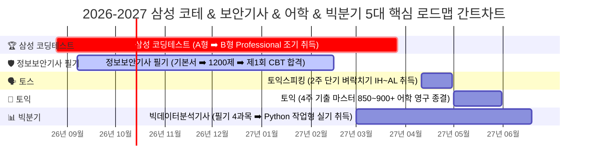

# 🎓 [AGENTS.md] IT 취업 최상위 4대 스펙 로드맵 (코테 B형 3월 + 보안기사 4월 + 빅분기 4/6월 + 토스/토익 5월 종결)

본 문서는 사용자의 명확한 최종 목표인 **"삼성 코딩테스트 B형(Pro) 3월 취득 & 정보보안기사 4월 동차 합격 & 빅데이터분석기사 4월 필기/6월 실기 동차 합격 & 토스/토익 5월 쾌속 종결"** 전략과, **"구글 스프레드시트(Google Sheets) 100% 호환성 및 무결점 레퍼런스 보증 시스템"**, 그리고 **"만년형(Perpetual) GitHub 잔디밭 & 간트차트 엔진"**을 완벽하게 체계화한 공식 지침서입니다.

---

## 1. 🏆 최종 완성 4대 스펙 (The Dream Quad-Combination)

국내 모든 IT 대기업(삼성전자, 네이버, 카카오 등), 금융권, 빅데이터/보안 전문 대기업 공채에서 **서류 프리패스 및 코테 면제/최상위 가산점**을 획득하는 최강의 포트폴리오입니다.

```
┌────────────────────────────────────────────────────────────────────────┐
│  [2027년 상반기 6월 최종 완성 4대 마스터 스펙]                         │
│  1. 💻 삼성 코딩테스트 B형 (Professional) : 2027년 3월 27일 조기 취득   │
│  2. 🛡️ 국가기술자격 정보보안기사 취득   : 2027년 4월 10일 동차 합격   │
│  3. 📊 국가기술자격 빅데이터분석기사 취득 : 2027년 6월 19일 동차 합격   │
│     (필기: 2027.04.03 합격 ➡️ 실기: 2027.06.19 최종 취득)              │
│  4. 🗣️ 토익스피킹 IH~AL & 토익 850+     : 2027년 5월 말 어학 영구 종결 │
└────────────────────────────────────────────────────────────────────────┘
```

### 💡 빅데이터분석기사 동시 완주가 현실적으로 가능한 전략적 이유
1. **필기 시너지 (2027.03.01 ~ 04.03)**: 정보보안기사 필기(2월 15일 CBT) 합격 후, 보안기사에서 다룬 데이터 관리/암호/시스템 인프라 지식이 빅분기 필기(데이터 기획/저장)와 **60% 이상 중복**되므로 4주간 기출 10회분 압축 풀이로 손쉽게 합격권(60점) 달성.
2. **실기 시너지 (2027.04.11 ~ 06.19)**: 보안기사 실기(4.10)가 끝난 직후 9주간 Python 실기에 올인합니다. 이미 삼성 B형 커스텀 자료구조까지 마스터한 최상위 알고리즘 구현력을 보유하고 있으므로, 파이썬 판다스(Pandas) 전처리 및 scikit-learn 머신러닝 파이프라인(작업형 1·2·3)은 압도적으로 수월하게 고득점 합격합니다.

---

## 2. 📊 통합 비주얼 간트차트 (Visual Gantt Chart)

> **[5대 핵심 트랙 타임라인]**
> 1. 🏆 **삼성 코딩테스트**: `2026.08.25 ~ 2027.03.27` (SSAFY A형 ➡️ B형 Pro 조기 취득)
> 2. 🛡️ **정보보안기사 필기**: `2026.09.07 ~ 2027.02.15` (기본서 43섹션 ➡️ 1200제 ➡️ 제1회 CBT 합격)
> 3. 🗣️ **토스 (토익스피킹)**: `2027.04.11 ~ 2027.04.30` (기출 10회 모의테스트 2주 벼락치기 IH/AL 취득)
> 4. 📖 **토익 (TOEIC)**: `2027.05.01 ~ 2027.05.31` (LC 만점 + RC 기출 5회분 4주 마스터 850~900+)
> 5. 📊 **빅분기 (빅데이터분석기사)**: `2027.03.01 ~ 2027.06.19` (필기 4과목 압축 합격 ➡️ Python 작업형 실기 최종 취득)

### 2.1 🧭 Mermaid 통합 타임라인 다이어그램 (5대 핵심 정예 트랙)



---

## 3. 🌿 만년형(Perpetual) 52주 롤링 히트맵 & 8월 25일 시작 단일 타임라인 원칙

```
┌────────────────────────────────────────────────────────────────────────┐
│  [만년형 잔디밭 & 일일 상세 테이블 7대 설계 원칙]                       │
│  1. 📅 8월 25일 수험 시작 W01 롤링 뷰포트: 수험 전 34주 텅 빈 공백 완전 박멸 │
│  2. 🔄 2026-2027 단일 52주 타임라인: 6개 분단 매트릭스 ➡️ 3개 정예 매트릭스 압축 │
│  3. 🛡️ C3 오버플로우 완전 박멸: B3 입력 ➡️ C3=B3 유지 + ';;;' 숨김 서식 각인 │
│  4. 📐 Rows 47~84 구 잔재 완전 격리: hidden=True 처리로 일일 테이블 매끄러운 연결 │
│  5. 🌐 로케일 무관 요일 연산: CHOOSE(WEEKDAY(C87, 2), "월", ..., "일") │
│  6. ⏸️ 보류(나중에 풀기) 제외 실적 무결: COUNTIFS(..., "<>보류*") 순수 해결 동기화 │
│  7. 🌿 잔디 열 너비 4.2 전수 균일화: 53개 열(C~BC) 오차 없는 정사각 타일 │
└────────────────────────────────────────────────────────────────────────┘
```

1. **8월 25일 수험 시작(W01) 52주 롤링 타임라인 단일화**:
   - 사용자의 실제 수험 시작일은 **2026년 8월 25일**입니다.
   - 1~12월 달력 기준 매트릭스로 인해 발생하던 **수험 시작 전 34주간의 텅 빈 공백을 100% 완전 제거**했습니다.
   - 2026년 8월 25일이 속한 주(2026.08.24)를 **W01**로 삼아 2027년 8월(W52)까지 연속으로 뻗어나가는 **단일 52주 롤링 뷰포트**로 통폐합했습니다.
   - 기존 6개 분단 매트릭스(2026년 3개 + 2027년 3개)를 **단 3개의 연속형 마스터 매트릭스**(종합 잔디밭, 코테 잔디밭, 자격증 잔디밭)로 압축 완성했습니다.
2. **C3 셀의 `##` 오버플로우 에러 원천 박멸**:
   - `B3` 셀에 연도 입력란을 상시 노출하고, `C3` 셀이 `=B3`으로 자동 동기화되어 하단 310일 테이블(`C87:C396`) 및 상단 잔디밭이 100% 동적 연동됩니다.
   - 열 너비 4.2인 C열에서 숫자가 `##`로 깨지는 현상을 방지하기 위해, `C3` 셀에 **`;;;` (숫자 완전 숨김) 표시 형식**과 흰색 폰트를 각인하여, 수식 무결성은 100% 유지하면서 화면 깨짐을 영구 박멸했습니다.
3. **간트차트 인라인 시험날(★) & 국문(필기/실기) & 오늘(📍) 시간 흐름 표기 철칙**:
   - **행 추가 절대 금지**: 기존 5대 핵심 정예 트랙(코테, 보안기사, 토스, 토익, 빅분기) 5개 행 구조를 엄격히 유지합니다.
   - **국문 및 테마 색상 인라인 표기**: 막대 바 셀 내부에 `"필기"`, `"실기"`, `"A형"`, `"B형"`, `"토스"`, `"토익"`을 직접 표출하고 고유의 소프트 파스텔 테마 색상을 부여합니다.
   - **시험날(D-Day) 스타(★) 하이라이트**: 시험 주차 셀에 `★A형`, `★B형`, `★필기`, `★실기`, `★토스`, `★토익`을 자동 판별하여 진홍색 코랄(`#FFE2E2` 배경 + `#991B1B` 볼드 + 테두리)로 강조합니다.
   - **오늘 날짜 및 시간의 흐름 인지**: 5행 주차 헤더에서 현재 주차를 자동 감지하여 `📍오늘` 배지(`#FFE4E6` 배경 + `#E11D48` 테두리)로 실시간 표출합니다. 주차 열(G~BF) 너비는 `5.0`으로 설정하여 글자 잘림을 원천 방지합니다.

---

## 4. 📂 파일 버전 관리 및 안전 카피-수정 철칙 (Version Control & Safe Copy Policy)

사용자의 명확하고 엄격한 지침에 따라, **개선 사항이나 수정 작업이 발생할 때마다 원본을 직접 덮어쓰지 않고, 사전에 복사본(카피)을 생성한 후 파일명을 버전업(`_v2.10`, `_v2.11`, `_v2.12`, `_v2.13`, ...)하여 단계별 히스토리를 영구 보존**합니다.

```
┌────────────────────────────────────────────────────────────────────────┐
│  [파일명 버전 관리 & 안전 카피 4대 철칙]                                │
│  1. 📋 사전 복사본 생성 (Copy First) : 수정 전 원본 백업본 즉시 생성   │
│  2. 🏷️ 파일명 버전 각인 (Version Stamp): yearlySchedule.v2.13.xlsx       │
│  3. 🛡️ 무결점 롤백 보장 (Safe Rollback) : 문제 발생 시 이전 버전 복원  │
│  4. 🚀 최신 완성본 자동 실행          : EXCEL.EXE 즉시 런칭 및 검토   │
└────────────────────────────────────────────────────────────────────────┘
```

- **🏆 최신 완성 파일 (yearlySchedule.v2.13)**: 
  - [`yearlySchedule.v2.13.xlsx`](file:///c:/Users/SSAFY/Downloads/tmp/yearlySchedule.v2.13.xlsx)
  - *(히스토리 아카이브)*: [`yearlySchedule.v2.12.xlsx`](file:///c:/Users/SSAFY/Downloads/tmp/yearlySchedule.v2.12.xlsx) | [`yearlySchedule.v2.11.xlsx`](file:///c:/Users/SSAFY/Downloads/tmp/yearlySchedule.v2.11.xlsx) | [`yearlySchedule.v2.10.xlsx`](file:///c:/Users/SSAFY/Downloads/tmp/yearlySchedule.v2.10.xlsx) | [`yearlySchedule.v2.9.xlsx`](file:///c:/Users/SSAFY/Downloads/tmp/yearlySchedule.v2.9.xlsx)
- **v2.13 핵심 업데이트 및 4대 마스터 혁신 사항**:
  1. **🛡️ 정보보안기사 3단계 완전정복 루틴 전면 개편**:
     - 기존 단일 일정에서 사용자의 실제 최적 학습 사이클인 **`[평일 화·목 개념정독 ➡️ 토요일 1200제 집중 문풀 ➡️ 일요일 취약점 오답정리]`**로 전면 재배치.
     - `03_보안기사_필기_DB` 컬럼 분리: Col G(화/목 개념 목표), Col H(개념 준수), Col N(토요일 1200제 문풀 목표), Col O(문풀 준수), Col M(5단계 통합 학습상태 판별), Col P(오답노트 메모) 완비.
     - 대시보드 52주 잔디밭 히트맵과 완전 연동 (평일 화/목 개념 + 토요일 문풀 + 일요일 오답정리 실적 입력 시 잔디 100% 자동 집계).
  2. **🏆 05번 시트 '알고리즘별 학습관리 (기본 3제 + 심화 3제)' 전면 개편**:
     - 상단 배너 공식 각인: `💡 알고리즘별 학습관리 | [기본: 문제 읽고 알고리즘/자료구조 구현 (3제)] & [심화: 알고리즘/자료구조 구현 + 어떠한 연산이나 기법 필요 (3제)] 6단계 마스터 파이프라인`.
     - 16개 정예 테마 × 6제 = **총 96제 마스터 관리 DB** 구축.
     - **기본 48제**: 문제 읽고 알고리즘 혹은 자료구조 직접 표준 구현.
     - **심화 48제**: 문제 읽고 알고리즘/자료구조 구현 및 특수 연산·기법(비트마스크, 가지치기, 누적합, 델타 등) 필요.
     - `02번 SWEA DB`와 VLOOKUP으로 실시간 학습상태(Col K) 및 풀이일자(Col L) 100% 자동 동기화.
  3. **🎯 SSAFY 강사 공식 라이브 수업 제시 / 과제 문제 16제 1:1 완벽 매핑**:
     - 라이브 제시: #5648(원자소멸), #6808(규영이와 인영이), #1873(상호의 배틀필드), #1767(프로세서 연결하기).
     - 과제 문제: #3499(퍼펙트셔플), #1226(미로1), #1227(미로2), #9229(SpotMart), #3421(수제버거), #1486(장훈이), #7206(숫자게임), #1868(지뢰찾기), #6782(제곱근) 등.
     - `02번 SWEA DB` Col E에 `📌[라이브 제시]`, `📌[과제]`, `📌[라이브 제시 / 과제(라이브풀이)]` 공식 태깅 완료.
  4. **🔥 2026.09.28 실시간 풀이 실적 (102제 돌파 & 오늘 📍W06 잔디 점등)**:
     - #26942 (D2 가전 설정 코드 풀기, HASH) & #26953 (D2 화물 입고 코드 점검) 풀이 즉시 반영.
     - 총 102제 해결 돌파 (D1: 41, D2: 46, D3: 12, D4: 2, D8: 1), 대시보드 오늘 📍W06 월요일 잔디 2개(연두색 🟩) 실시간 반영.
- **📋 공식 패치노트**: [`PATCH_NOTES.md`](file:///c:/Users/SSAFY/Downloads/tmp/PATCH_NOTES.md)
- **🛡️ QA 전용 감사관 지침서 & 자율 파이프라인**: [`QA_AGENT.md`](file:///c:/Users/SSAFY/Downloads/tmp/QA_AGENT.md)

---

## 5. 🖥️ 작업 완료 시 Microsoft Excel 파일 자동 실행 및 사용자 직접 검토 철칙 (Mandatory Excel Launch & Review Policy)

사용자의 엄격하고 명확한 지침에 따라, **모든 기능 개발, 데이터 수정, 수식 변경, QA 검증 작업이 완료되면 반드시 Microsoft Excel 프로그램(`EXCEL.EXE`)으로 최신 완성본 엑셀 파일을 사용자 화면에 직접 실행(Launch)하여 띄우고, 사용자에게 즉시 검토받아야 합니다.**
(단순한 파일 탐색기 폴더 열기나 채팅창 링크 안내에 그치지 않고, 반드시 실제 엑셀 프로그램 창을 즉시 활성화하여 사용자가 눈앞에서 결과를 직접 검토할 수 있도록 조치해야 함)

```bash
# PowerShell 기반 최신 완성본 엑셀 실행
powershell -Command "Start-Process 'C:\Program Files\Microsoft Office\root\Office16\EXCEL.EXE' -ArgumentList 'c:\Users\SSAFY\Downloads\tmp\yearlySchedule.v2.13.xlsx'"
```


